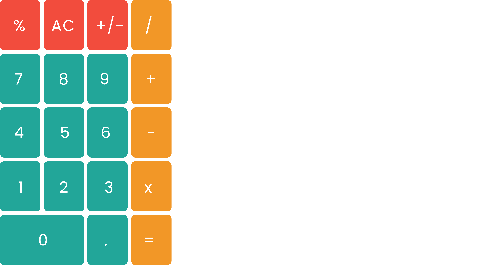

A very complex calculator app made with Swift.

## What is this for?
It's just a simple calculator app. It's for calculating stuff. I made this app to learn and gain the ability to use computed properties, Swift tuples and Structs. I also learned more about when to use Structs and when to use Classes, as well as when to use guard let or if let.
## Contribution
Feel free to contribute to this project. All feedback is much appreciated.
